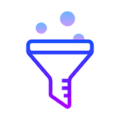

# Awesome Curation Filtering 
> A filter to navigate awesome curated lists

Easily navigate through curated lists to find the most popular GitHub repositories listed or smaller known ones to help contribute to.

## To-Do

+ Add more table sections
   - Last commit day
   - Total commits
   - Total contributors
   - Watchers
   - +- Activity (ex. +50 stars past month)
   - Dynamic table columns with datatables
+ Tests
   - None yet (yikes)
   - Travis CI
+ Error Handling/Logs
   - Log excepts
   - Return custom errors from failed functions
+ Cron Job Updates
   - Setup server to update daily
   - Monitor & handle GitHub hourly api call limit
      * Needs CI setup first
+ Create sub sections
   - Sub text divider
+ API
   - Error codes
   - Get data asynchronously 
   - Get remaining queries
+ Data handling
   - Store data in files/db
   - Fetch table data & insert for each section 

## Contributing

Please read [CONTRIBUTING.md](CONTRIBUTING.md) for details on the process for submitting pull requests to us. 

## Authors

* **Ryan Hennings** - *Initial work* - [ryans-git](https://github.com/ryans-git)

See also the list of [contributors](https://github.com/Awesome-Curation/awesome-curation.github.io/graphs/contributors) who participated in this project.

## License

This project is licensed under the Creative Commons Attribution-ShareAlike 4.0 - see the [LICENSE.md](LICENSE.md) file for details
## Acknowledgments

* Inspired by the amazing curation lists put together by the GitHub community
* [GitHub API](https://developer.github.com/v3/)
* [GitHub Pages - Cayman Theme](https://github.com/pages-themes/cayman)
* [Bootstrap HTML, CSS, & JS](https://getbootstrap.com/)
* [DataTables](https://datatables.net/)
* [Popper.js](https://popper.js.org/)
